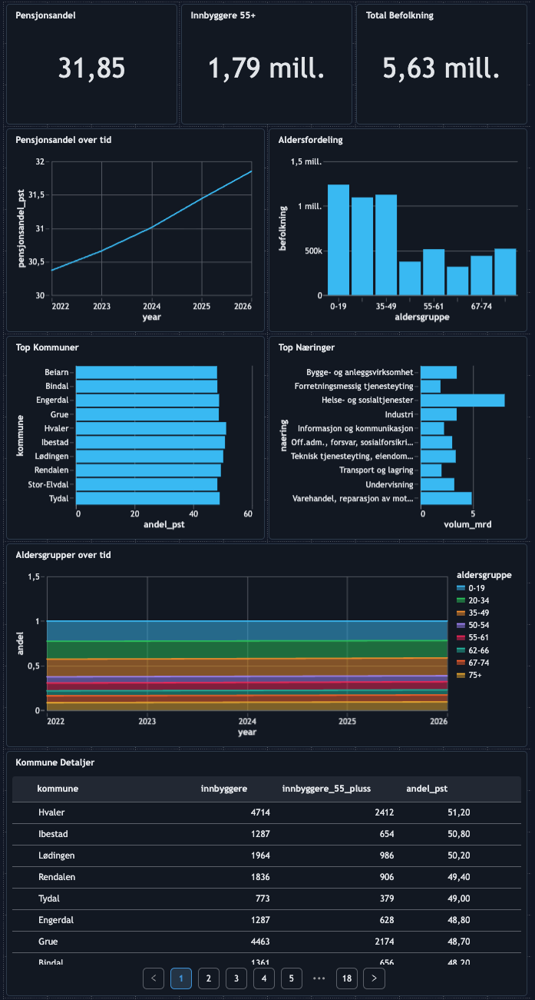

# Pensjon Lakehouse

## Om prosjektet

Et Databricks, Python, SQL og Git-prosjekt for å lære å tenke "Lakehouse-arkitektur" i skymiljø i form av Azure.

Prosjektet foretar en enkel analyse av aldersfordelingen i norske kommuner for å undersøke hvor "eldrebølgen" er mest fremtredende, og dermed risikoen for et tenkt forsikringsselskap.

Data hentes fra SSBs åpne API og foredles gjennom lagene Bronze → Silver → Gold i Databricks med Unity Catalog. Resultatet visualiseres i et interaktivt Databricks-dashboard og publiseres som statisk GitHub Pages-side.


## Dashboard

<p align="center">
  <a href="https://fredrikve.github.io/Pensjon-Lakehouse/">
    
  </a>
</p>

### Screenshot av dashboard i Databricks




## Problemstilling

Hvilke kommuner og næringer har størst demografisk pensjonsrelevans i Norge?

Prosjektet kombinerer befolkningsdata (alder per kommune) med lønns- og sysselsettingsdata (per næring) for å belyse:

- Hvor stor andel av befolkningen er i pensjonsrelevant alder (55+)?
- Hvordan utvikler denne andelen seg over tid?
- Hvilke næringer har størst estimert pensjonsvolum?


## Arkitektur


## Datakilder

| Kilde | SSB-tabell | Innhold |
|-------|-----------|---------|
| Befolkning | [07459](https://www.ssb.no/statbank/table/07459) | Befolkning etter alder og kommune |
| Lønn/sysselsetting | [11654](https://www.ssb.no/statbank/table/11654) | Lønnstakere og månedslønn per næring |


## Lagdeling

| Lag | Innhold | Prinsipp |
|-----|---------|----------|
| **Bronze** | Rå SSB-data, alle dimensjoner, metadata (`_ingest_ts`, `_source`, `_batch_id`) | Ufiltrert, reproduserbar |
| **Silver** | Filtrert til kommuner, renset alder, pivotering, pensjonsandel | Renset, koblet |
| **Gold** | Trender, topp-kommuner, næringsprofil, aldersfordeling | Forretningsklart |


## Gold-tabeller

| Tabell | Beskrivelse |
|--------|-------------|
| `pensjonsandel_trend` | Vektet landsgjennomsnitt 55+ per år |
| `top_kommuner_pensjonsalder` | Topp 20 kommuner med høyest andel 55+ |
| `naering_pensjonsvolum` | Næringer rangert etter estimert pensjonsvolum |
| `aldersgruppe_fordeling` | Fordeling på 8 aldersgrupper, siste år |
| `aldersgruppe_trend` | Aldersgruppe-andeler over tid |


## Notebooks

| # | Notebook | Beskrivelse |
|---|----------|-------------|
| 01 | `01_bronze_ingest` | Henter data fra SSB API, skriver til bronze Delta-tabeller |
| 02 | `02_silver` | Bygger silver-tabeller med ren SQL |
| 03 | `03_gold` | Bygger gold-tabeller med ren SQL |
| 04 | `04_dashboard_setup` | SQL-spørringer og guide for Databricks-dashboardet |
| 05 | `05_generate_github_dashboard` | Genererer statisk HTML-dashboard fra Gold-data |

## Databicks-dashboard

Dashboardet som kjøres inne på Databriks ligger i filen `Pensjon Dashboard.lvdash.json`, og brukes til å visalisere datane i **notebook 3 med data på gold-standard**, dvs notebooken `03_gold.ipynb`.

Det er viktig at notebook 1, notebook 2 og notebook 3 kjøres først.


## Kjøring

Forutsetninger: Databricks workspace med Unity Catalog og tilgang til en SQL Warehouse eller cluster.

**Kjør i rekkefølge:**

1. Importer notebooks fra `notebooks/`-mappen
2. Kjør `01_bronze_ingest` — henter data fra SSB og oppretter bronze-tabeller
3. Kjør `02_silver` — bygger silver-tabeller
4. Kjør `03_gold` — bygger gold-tabeller
5. Kjør `05_generate_github_dashboard` — genererer `showcase-page/index.html` og `showcase-page/assets/js/data.js` fra Gold-data


## Prosjektstruktur

```bash
Pensjon-Lakehouse/
├── README.md
│
├── dashboards/
│   └── Pensjon Dashboard.lvdash.json         -> Databricks Lakeview dashboard-config
│
├── notebooks/                                -> Databricks-notebooks, prosjektets hovedfokus
│   ├── 01_bronze_ingest.ipynb
│   ├── 02_silver.ipynb
│   ├── 03_gold.ipynb
│   ├── 04_dashboard_setup.ipynb
│   └── 05_generate_github_dashboard.ipynb    -> Genererer statisk showcase-side
│
├── resources/                                -> Bilder til README/dokumentasjon
│   ├── Dashboard.png
│   ├── architecture.svg
│   └── dashboard_button.svg
│
└── showcase-page/                            -> Statisk GitHub Pages-showcase
    ├── index.html                            -> Generert dashboard-side
    ├── robots.txt
    │
    ├── assets/
    │   ├── css/
    │   │   ├── main.css
    │   │   ├── tokens.css
    │   │   ├── base.css
    │   │   ├── layout.css
    │   │   ├── components.css
    │   │   ├── table.css
    │   │   └── responsive.css
    │   └── js/
    │       ├── data.js                       -> Dashboarddata generert av notebook 05
    │       ├── charts.js
    │       ├── table.js
    │       └── main.js
    │
    ├── sql/                                  -> SQL-spørringer for notebook 05
    │   ├── aldersfordeling.sql
    │   ├── aldersgruppe_trend.sql
    │   ├── kommuner_detalj.sql
    │   ├── pensjonsandel_latest.sql
    │   ├── pensjonsandel_trend.sql
    │   ├── top_kommuner.sql
    │   └── top_naeringer.sql
    │
    └── templates/
        └── index.html.tpl                    -> HTML-template for GitHub Pages
```


## Forklaring av mappestruktur

Prosjektet har en tydelig separasjon mellom Databricks-logikk, SQL, frontend og genererte filer:

<table>
  <thead>
    <tr>
      <th>Mappe</th>
      <th>Innhold</th>
    </tr>
  </thead>
  <tbody>
    <tr>
      <td><code>notebooks/</code></td>
      <td>Databricks-notebookene som kjører pipelinen fra Bronze til Silver og Gold. Dette er hoveddelen av prosjektet.</td>
    </tr>
    <tr>
      <td><code>showcase-page/</code></td>
      <td>Statisk GitHub Pages-showcase av dashboardet. Mappen inneholder generert HTML, frontend-filer, SQL-spørringer og HTML-template brukt av notebook 05.</td>
    </tr>
    <tr>
      <td><code>showcase-page/sql/</code></td>
      <td>SQL-spørringene som notebook 05 bruker for å hente data fra Gold-tabellene i Unity Catalog. Template-variabler som <code>$catalog</code> og <code>$schema</code> substitueres ved kjøring.</td>
    </tr>
    <tr>
      <td><code>showcase-page/templates/</code></td>
      <td>HTML-templaten for GitHub Pages-dashboardet. KPI-plassholdere som <code>$kpi_year</code>, <code>$kpi_pensjonsandel</code> osv. fylles inn av notebook 05.</td>
    </tr>
    <tr>
      <td><code>showcase-page/assets/</code></td>
      <td>CSS og JavaScript for det statiske dashboardet. <code>data.js</code> genereres av notebook 05, resten er håndskrevne frontend-filer.</td>
    </tr>
    <tr>
      <td><code>dashboards/</code></td>
      <td>Databricks Lakeview-konfigurasjonen som vises visuelt i Databricks-workspacen.</td>
    </tr>
    <tr>
      <td><code>resources/</code></td>
      <td>Bilder og SVG-er brukt i README og dokumentasjon.</td>
    </tr>
  </tbody>
</table>


## Designvalg

**Vektet nasjonalt gjennomsnitt.** <br>
Pensjonsandel-trend beregnes som `SUM(55+) / SUM(total)`, ikke `AVG(kommuneandeler)`. Et uvektet snitt ville gitt feil bilde fordi små kommuner ville veid like mye som store.

**SQL eier transformasjonslogikken.** <br>
Python henter data og orkestrerer, men all rensing, kobling og aggregering skjer i SQL. Det gjør logikken transparent og enkel å endre.

**Bronze er rå.** <br>
Bronze inneholder ufiltrert SSB-data med alle dimensjoner. Filtrering skjer først i Silver, slik at regler kan endres uten å hente data på nytt.

**Ekstern SQL og HTML for showcase-siden.** <br>
Notebook 05 inneholder ingen hardkodet SQL eller HTML for den statiske GitHub Pages-versjonen. Spørringer leses fra `showcase-page/sql/*.sql`, og HTML bygges fra `showcase-page/templates/index.html.tpl`. Resultatet skrives til `showcase-page/index.html` og `showcase-page/assets/js/data.js`.

**Estimert pensjonsvolum.** <br>
Beregnet som `lønnstakere × månedslønn × 12 × 2 % OTP` — en forenkling, men gir et relativt bilde av næringenes pensjonsrelevans.


## Teknologier

<table>
  <tbody>
    <tr>
      <td>1</td>
      <td>Python</td>
    </tr>
    <tr>
      <td>2</td>
      <td>SQL</td>
    </tr>
    <tr>
      <td>3</td>
      <td>Databricks</td>
    </tr>
    <tr>
      <td>4</td>
      <td>Azure</td>
    </tr>
    <tr>
      <td>5</td>
      <td>Chart.js</td>
    </tr>
    <tr>
      <td>6</td>
      <td>GitHub Pages</td>
    </tr>
  </tbody>
</table>