# Pensjon Lakehouse

## Om prosjektet
Et Databricks, Python, SQL og Git-prosjekt for å lære å enke "Lakehouse-arkitektur" i skymiljø i form av Azure.

Lakehouse-prosjekt for foretar en enkel alalyse av aldersfordelingen i Norske kommuner for å undersøke hvor "eldrebølgen" 
er mest fremtredende, og dermed risikoen for et tenkt forsikrings-selskap.

Prosjektet henter åpne data fra SSB, og "foredler" og modellerer disse gjennom følgende arkitkekturlag.

1) Bronze
2) Silver
3) Gold

Og lagrer disse dataene på "gold-format" i Databricks med Unity Catalog. 
Deretter visualiseres resultatet i et interaktivt Databricks dashboard.


## Dashboard


### Trykk her for å se Dashboardet

<p align="center">
  <a href="https://fredrikve.github.io/Pensjon-Lakehouse/">
    
  </a>
</p>


## Problemstilling

Hvilke kommuner og næringer har størst demografisk pensjonsrelevans i Norge?

Prosjektet kombinerer befolkningsdata (alder per kommune) med lønns- og sysselsettingsdata (per næring) for å belyse:

- Hvor stor andel av befolkningen er i pensjonsrelevant alder (55+)?
- Hvordan utvikler denne andelen seg over tid?
- Hvilke næringer har størst estimert pensjonsvolum?

## Arkitektur



## Datakilder

| Kilde | SSB-tabell | Innhold |
|-------|-----------|---------|
| Befolkning | [07459](https://www.ssb.no/statbank/table/07459) | Befolkning etter alder og kommune |
| Lønn/sysselsetting | [11654](https://www.ssb.no/statbank/table/11654) | Lønnstakere og månedslønn per næring |

## Lagdeling

| Lag | Innhold | Prinsipp |
|-----|---------|----------|
| **Bronze** | Rå SSB-data, alle dimensjoner, metadata (_ingest_ts, _source, _batch_id) | Ufiltrert, reproduserbar |
| **Silver** | Filtrert til kommuner, renset alder, pivotering, pensjonsandel | Renset, koblet |
| **Gold** | Trender, topp-kommuner, næringsprofil, aldersfordeling | Forretningsklart |

## Gold-tabeller

| Tabell | Beskrivelse |
|--------|-------------|
| `pensjonsandel_trend` | Vektet landsgjennomsnitt 55+ per år |
| `top_kommuner_pensjonsalder` | Topp 20 kommuner med høyest andel 55+ |
| `naering_pensjonsvolum` | Næringer rangert etter estimert pensjonsvolum |
| `aldersgruppe_fordeling` | Fordeling på 8 aldersgrupper, siste år |
| `aldersgruppe_trend` | Aldersgruppe-andeler over tid |


## Notebooks

| # | Notebook | Beskrivelse |
|---|----------|-------------|
| 01 | `01_bronze_ingest` | Henter data fra SSB API, skriver til bronze Delta-tabeller |
| 02 | `02_silver` | Bygger silver-tabeller med ren SQL |
| 03 | `03_gold` | Bygger gold-tabeller med ren SQL |
| 04 | `04_dashboard_setup` | SQL-spørringer og guide for Databricks-dashboardet |
| 05 | `05_generate_github_dashboard` | Genererer statisk HTML-dashboard fra Gold-data |

Kjør i rekkefølge: 01 → 02 → 03 → (04 og/eller 05).

## Kjøring

Forutsetninger: Databricks workspace med Unity Catalog og tilgang til en SQL Warehouse eller cluster.

1. Importer notebooks fra `notebooks/`-mappen
2. Kjør `01_bronze_ingest` — henter data fra SSB og oppretter bronze-tabeller
3. Kjør `02_silver` — bygger silver-tabeller
4. Kjør `03_gold` — bygger gold-tabeller
5. Kjør `05_generate_github_dashboard` — genererer `index.html` for GitHub Pages

## Designvalg

**Vektet nasjonalt gjennomsnitt.** Pensjonsandel-trend beregnes som `SUM(55+) / SUM(total)`, ikke `AVG(kommuneandeler)`. Et uvektet snitt ville gitt feil bilde fordi små kommuner ville veid like mye som store.

**SQL eier transformasjonslogikken.** Python henter data og orkestrerer, men all rensing, kobling og aggregering skjer i SQL. Det gjør logikken transparent og enkel å endre.

**Bronze er rå.** Bronze inneholder ufiltrert SSB-data med alle dimensjoner. Filtrering skjer først i Silver, slik at regler kan endres uten å hente data på nytt.

**Estimert pensjonsvolum.** Beregnet som `lønnstakere × månedslønn × 12 × 2 % OTP` — en forenkling, men gir et relativt bilde av næringenes pensjonsrelevans.

## Teknologier

Python · SQL · Databricks · Unity Catalog · Delta Lake · Chart.js · GitHub Pages

## Prosjektstruktur

```
Pensjon-Lakehouse/
├── README.md
├── index.html                          # GitHub Pages dashboard (generert)
├── docs/
└── notebooks/
    ├── 01_bronze_ingest.ipynb
    ├── 02_silver.ipynb
    ├── 03_gold.ipynb
    ├── 04_dashboard_setup.ipynb
    ├── 05_generate_github_dashboard.ipynb
    └── pensjon_dashboard.lvdash.json   # Databricks Lakeview dashboard-config
```