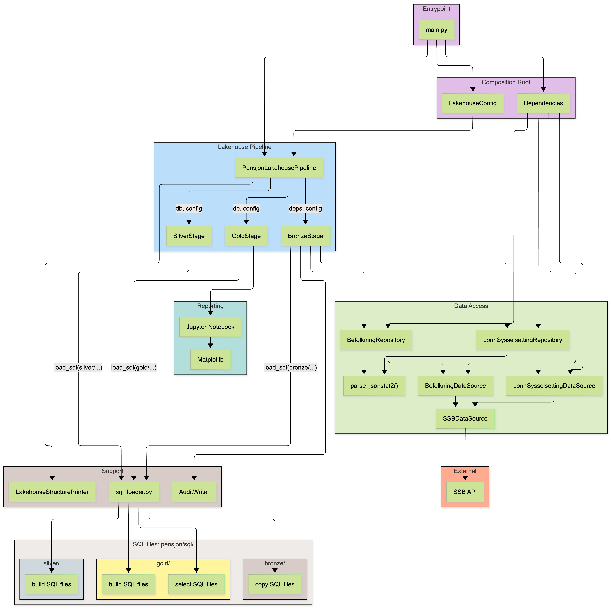

# Pensjon Lakehouse

En datapipeline som henter **ekte data fra SSB** og lander dem i en enkel **Data Lakehouse-arkitektur** med lagene **Bronze → Silver → Gold**.

Prosjektet analyserer pensjonsrelevante mønstre i norske kommuner og næringer:

- demografi og alderssammensetning
- andel innbyggere 55+
- kommuner med høy pensjonsmodenhet
- næringer med høyt estimert pensjonsvolum
- utvikling i aldersgrupper over tid

Prosjektet er bygget som et lite porteføljeprosjekt med tydelig separasjon mellom datainnhenting, transformasjon, SQL-logikk, pipeline-steg og rapportering.

---

## Hva prosjektet gjør

Pipelinen henter to datasett fra SSBs åpne API:

| Kilde | SSB-tabell | Innhold |
|---|---:|---|
| Befolkning | 07459 | Befolkning per alder og kommune |
| Lønn/sysselsetting | 11654 | Antall lønnstakere og gjennomsnittlig månedslønn per næring |

Dataene lagres som Parquet-filer under:

```text
/tmp/pensjon_lakehouse/
```

Pipelinen bygger tre datalag:

```text
Bronze → Silver → Gold
```

Rapportering og visualisering skjer i Jupyter Notebook, og notebooken leser i størst mulig grad fra **Gold-laget**.

---

## Arkitektur

Prosjektet er bygget som en enkel lakehouse-pipeline med tydelig separasjon mellom datainnhenting, transformasjon og rapportering. `main.py` starter applikasjonen, `Dependencies` setter opp datakilder og repositories, og `PensjonLakehousePipeline` orkestrerer kjøringen gjennom `BronzeStage`, `SilverStage` og `GoldStage`. SQL-transformasjonene ligger som egne `.sql`-filer under `pensjon/sql/` og lastes inn via `sql_loader.py`. Notebooken leser rapportklare data fra Gold-laget og visualiserer resultatene med Matplotlib.



## Overordnet dataflyt

```text
SSB API
  ↓
DataSource
  ↓
Repository
  ↓
Pandas DataFrame
  ↓
DuckDB
  ↓
Bronze Parquet
  ↓
Silver Parquet
  ↓
Gold Parquet
  ↓
Notebook / rapport / visualisering
```

---

## Lakehouse-lagene

### Bronze

Bronze-laget inneholder rådata fra SSB, landet som Parquet.

Bronze-dataene er i hovedsak rå, men får lagt på enkel metadata:

- `_ingest_ts`
- `_source`
- `_batch_id`

Eksempel på output:

```text
/tmp/pensjon_lakehouse/bronze/
├── befolkning/
│   └── data.parquet
└── lonn_sysselsetting/
    └── data.parquet
```

---

### Silver

Silver-laget foredler Bronze-data til analytiske mellomtabeller.

Eksempel på output:

```text
/tmp/pensjon_lakehouse/silver/
├── befolkning_pensjon.parquet
├── befolkning_aldersgrupper.parquet
└── naering_pensjon.parquet
```

Silver-tabellene inneholder blant annet:

| Fil | Innhold |
|---|---|
| `befolkning_pensjon.parquet` | Befolkning per kommune og år, med beregnet andel 55+ |
| `befolkning_aldersgrupper.parquet` | Befolkning fordelt på aldersgrupper per kommune og år |
| `naering_pensjon.parquet` | Næringer med lønnstakere, månedslønn og estimert pensjonsvolum |

---

### Gold

Gold-laget inneholder rapportklare datasett.

Eksempel på output:

```text
/tmp/pensjon_lakehouse/gold/
├── top_kommuner_pensjonsalder.parquet
├── naering_pensjonsvolum.parquet
├── pensjonsandel_trend.parquet
├── aldersgruppe_fordeling_siste_ar.parquet
├── aldersgruppe_trend.parquet
└── aldersfordeling_siste_ar.parquet
```

Gold-tabellene brukes direkte av terminal-output og notebook-rapporten.

| Fil | Innhold |
|---|---|
| `top_kommuner_pensjonsalder.parquet` | Toppliste over kommuner med høyest andel 55+ |
| `naering_pensjonsvolum.parquet` | Næringer rangert etter estimert pensjonsvolum |
| `pensjonsandel_trend.parquet` | Utvikling i gjennomsnittlig andel 55+ over tid |
| `aldersgruppe_fordeling_siste_ar.parquet` | Aldersgruppefordeling for nyeste år |
| `aldersgruppe_trend.parquet` | Aldersgrupper som andel av befolkningen per år |
| `aldersfordeling_siste_ar.parquet` | Ettårsaldersfordeling for nyeste år, brukt til fordelingskurve |

---

## Prosjektstruktur

```text
Pensjon-Lakehouse/
├── README.md
├── main.py
├── notebooks/
│   └── 01_pensjonsdemografi_og_pensjonsvolum.ipynb
└── pensjon/
    ├── datasource/
    │   ├── befolkning_datasource.py
    │   ├── jsonstat_parser.py
    │   ├── lonn_datasource.py
    │   └── ssb_datasource.py
    │
    ├── di/
    │   └── dependencies.py
    │
    ├── repository/
    │   ├── arbeidsmarked_repository.py
    │   └── befolkning_repository.py
    │
    ├── usecase/
    │   └── pensjon_usecases.py
    │
    ├── lakehouse/
    │   ├── audit_writer.py
    │   ├── config.py
    │   ├── pipeline.py
    │   ├── structure_printer.py
    │   └── stages/
    │       ├── bronze_stage.py
    │       ├── silver_stage.py
    │       └── gold_stage.py
    │
    ├── sql/
    │   ├── bronze/
    │   │   ├── copy_befolkning_to_bronze.sql
    │   │   └── copy_lonn_syss_to_bronze.sql
    │   │
    │   ├── silver/
    │   │   ├── build_befolkning_pensjon.sql
    │   │   ├── build_befolkning_aldersgrupper.sql
    │   │   └── build_naering_pensjon.sql
    │   │
    │   └── gold/
    │       ├── build_top_kommuner_pensjonsalder.sql
    │       ├── build_naering_pensjonsvolum.sql
    │       ├── build_pensjonsandel_trend.sql
    │       ├── build_aldersgruppe_fordeling_siste_ar.sql
    │       ├── build_aldersgruppe_trend.sql
    │       ├── build_aldersfordeling_siste_ar.sql
    │       ├── select_top_kommuner.sql
    │       ├── select_naering_pensjonsvolum.sql
    │       ├── select_pensjonsandel_trend.sql
    │       ├── select_aldersgruppe_fordeling_siste_ar.sql
    │       └── select_aldersgruppe_trend.sql
    │
    └── sql_loader.py
```

---

## Viktige komponenter

### `main.py`

Entry point for applikasjonen.

```python
from pensjon.di.dependencies import Dependencies
from pensjon.lakehouse.config import LakehouseConfig
from pensjon.lakehouse.pipeline import PensjonLakehousePipeline


if __name__ == "__main__":
    pipeline = PensjonLakehousePipeline(
        deps=Dependencies(),
        config=LakehouseConfig(),
    )

    pipeline.run()
```

---

### `pensjon/lakehouse/pipeline.py`

Orkestrerer hele kjøringen:

```text
setup lakehouse
  ↓
BronzeStage
  ↓
SilverStage
  ↓
GoldStage
  ↓
print filstruktur
```

---

### `pensjon/lakehouse/stages/bronze_stage.py`

Henter data fra repositories, lager Pandas DataFrames og skriver rådata til Bronze.

---

### `pensjon/lakehouse/stages/silver_stage.py`

Kjører Silver-SQL:

- `build_befolkning_pensjon.sql`
- `build_befolkning_aldersgrupper.sql`
- `build_naering_pensjon.sql`

---

### `pensjon/lakehouse/stages/gold_stage.py`

Kjører Gold-SQL og printer forretningsklare analyser til terminalen:

- toppliste kommuner med høyest andel 55+
- næringer etter estimert pensjonsvolum
- pensjonsandel-trend
- aldersgruppefordeling
- aldersgruppe-trend

---

### `pensjon/sql_loader.py`

Laster SQL-filer fra `pensjon/sql/` og erstatter parametere som `$lake` og `$batch_id`.

Eksempel:

```python
load_sql(
    "silver/build_befolkning_pensjon.sql",
    lake=self.lake,
)
```

SQL-filene er vanlige `.sql`-filer, ikke Python-strenger.

---

## Kjøring

### 1. Installer avhengigheter

```bash
pip install duckdb pandas requests matplotlib jupyter
```

Eller installer i prosjektets virtuelle miljø.

---

### 2. Kjør pipeline

```bash
python main.py
```

Pipelinen henter data fra SSB, skriver Parquet-filer til `/tmp/pensjon_lakehouse/`, og printer analyseresultatene i terminalen.

---

### 3. Start notebook

```bash
jupyter notebook
```

Åpne:

```text
notebooks/01_pensjonsdemografi_og_pensjonsvolum.ipynb
```

Notebooken forventer at `python main.py` er kjørt først.

---

## Forventet terminal-output

Eksempel på output:

```text
================================================================
  PENSJON LAKEHOUSE
  SSB-data → Bronze → Silver → Gold
================================================================

────────────────────────────────────────────────────────────────
  BRONZE – Henter data fra SSB
────────────────────────────────────────────────────────────────
  ✓ Befolkning: 504030 rader
  ✓ Lønn/sysselsetting: 72 rader

────────────────────────────────────────────────────────────────
  SILVER – Rensing og kobling
────────────────────────────────────────────────────────────────
  ✓ Befolkning pensjonsandel: 1783 rader (kommune × år)
  ✓ Befolkning aldersgrupper: 38040 rader
  ✓ Næring pensjonsvolum: 72 rader

────────────────────────────────────────────────────────────────
  GOLD – Forretningsklare analyser
────────────────────────────────────────────────────────────────
  Top 10 kommuner med høyest andel 55+
  Næringer etter estimert pensjonsvolum
  Pensjonsandel-trend
  Aldersgruppefordeling siste år
  Aldersgruppe-trend

────────────────────────────────────────────────────────────────
  FILSTRUKTUR
────────────────────────────────────────────────────────────────
  pensjon_lakehouse/
    │ _audit/  ← 1 json
    │ bronze/
    │ gold/    ← 6 parquet
    │ silver/  ← 3 parquet

================================================================
  ✓ Pipeline fullført
================================================================
```

---

## Notebook-rapport

Notebooken visualiserer Gold-dataene med Matplotlib.

Den viser blant annet:

- gjennomsnittlig pensjonsandel 55+ over tid
- kommuner med høyest andel 55+
- aldersgruppefordeling nyeste år
- aldersfordelingskurve nyeste år
- endring i aldersgrupper fra første til siste år
- seniorer 55+ per person i alderen 20–54
- næringer med høyest estimert pensjonsvolum
- lønnstakere og månedslønn per næring

Rapporten leser kun fra Gold-laget:

```text
/tmp/pensjon_lakehouse/gold/*.parquet
```

---

## Beregninger

### Pensjonsandel 55+

Pensjonsandel beregnes som:

```text
befolkning 55+ / total befolkning
```

Dette beregnes per kommune og år i Silver-laget, og aggregeres videre i Gold-laget.

---

### Aldersgrupper

Befolkningen grupperes slik:

| Aldersgruppe | Tolkning |
|---|---|
| `0-19` | Barn og unge |
| `20-34` | Unge voksne |
| `35-49` | Etablerte yrkesaktive |
| `50-54` | Sen yrkesaktiv alder |
| `55-61` | Senior yrkesaktiv |
| `62-66` | Tidlig pensjonsalder |
| `67-74` | Pensjonsalder |
| `75+` | Eldre |

---

### Estimert pensjonsvolum

Estimert pensjonsvolum beregnes som:

```text
lønnstakere × månedslønn × 12 × 0.02
```

Dette er en enkel modell for å anslå et mulig årlig pensjonsgrunnlag basert på 2 % innskudd.

---

## Teknologier

| Teknologi | Rolle |
|---|---|
| DuckDB | Analytisk SQL-motor som leser og skriver Parquet |
| Pandas | Mellomledd mellom Python-data og DuckDB |
| Parquet | Kolonnebasert lagringsformat |
| Matplotlib | Visualisering i notebook |
| Jupyter Notebook | Rapportering og utforskende analyse |
| Requests | HTTP-kall mot SSB |
| JSON-stat2 | Responsformat fra SSB |

---

## Git og filer som ikke bør sjekkes inn

Prosjektet bør ikke sjekke inn lokale cache-filer, virtuelle miljøer eller notebook checkpoints.

Anbefalt `.gitignore`:

```gitignore
__pycache__/
*.pyc
.venv/
.env
.DS_Store

.ipynb_checkpoints/
**/.ipynb_checkpoints/

.pytest_cache/
.mypy_cache/
.ruff_cache/

/tmp/
```

Parquet-filene i `/tmp/pensjon_lakehouse/` er genererte datafiler og skal ikke ligge i Git.

---

## Kjente begrensninger

- Pipelinen sletter og bygger `/tmp/pensjon_lakehouse/` på nytt ved hver kjøring.
- Det finnes foreløpig ikke tester.
- Feilhåndtering kan forbedres per datakilde.
- Estimert pensjonsvolum er en forenklet beregning, ikke en faktisk forsikrings- eller pensjonsberegning.
- Noen Gold-transformasjoner kan fortsatt forbedres slik at Gold-laget konsekvent kun bygger på Silver-laget.

---

## Mulige forbedringer

- Legge til tester for JSON-stat-parser og SQL-transformasjoner.
- Flytte hardkodede tabellvalg og stier til config.
- Lage et eget `requirements.txt`.
- Lage enkel CLI, for eksempel `python main.py --lake-path ...`.
- Lage flere Gold-tabeller for kommune × næring dersom datagrunnlaget utvides.
- Lage HTML-rapport eller dashboard basert på Gold-laget.

---

## Lisens og datakilder

Data hentes fra Statistisk sentralbyrås åpne API.

Prosjektet er ment som et lærings- og porteføljeprosjekt.
